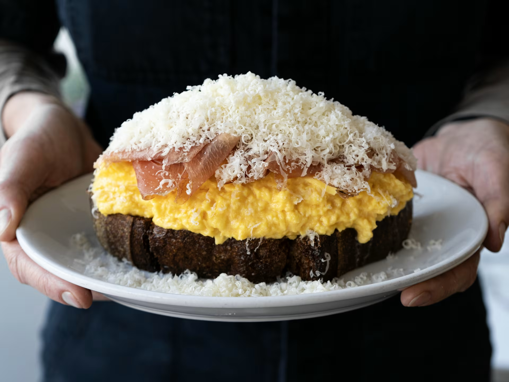

# Cafe Roze

**Neighborhood:** East Nashville
**Price:** $
**Vibe tags:** food, east nashville

## Why it's worth it
Our go-to neighborhood restaurant. They're open 7 days a week for breakfast, lunch and dinner. I'd say grab a reservation if you plan to visit.

## Top picks
- country ham toast
- simple breakfast
- broccoli melt (add grilled chicken)
- oysters
- pistola or martinez (cocktails)
- preserved lemon labna
- gnocchi
- smoked trout dip
- swordfish
- the duck is just excellent
- paprika chicken.

## Good for
breakfast, lunch & dinner (and great cocktails)

## Quick details
- Address: 1115 Porter Rd, Nashville, TN 37206
- Map: https://maps.app.goo.gl/8ujYR16ccpfKbU669
- Website: https://www.caferoze.com/
