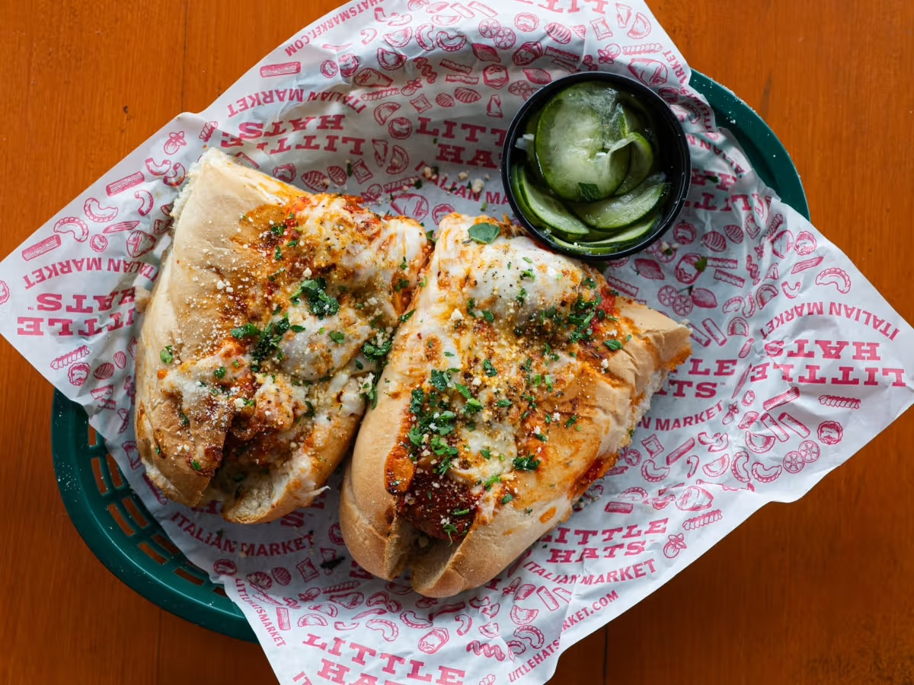

# Little Hats Market

**Neighborhood:** Germantown
**Price:** $
**Vibe tags:** food, germantown

## Why it's worth it
An Italian market and excellent deli counter with something for everyone.

## Top picks
- great pasta and sandwiches: sausage peppers & onions
- chicago style beef (jue on the side)
- Bolognese Rigatoni

## Good for
breakfast, lunch & dinner (and great cocktails)

## Quick details
- Address: 1120 4th Ave N #101, Nashville, TN 37208
- Map: https://maps.app.goo.gl/x6fqSLB1uXrJTkui9
- Website: https://www.littlehatsmarket.com/
