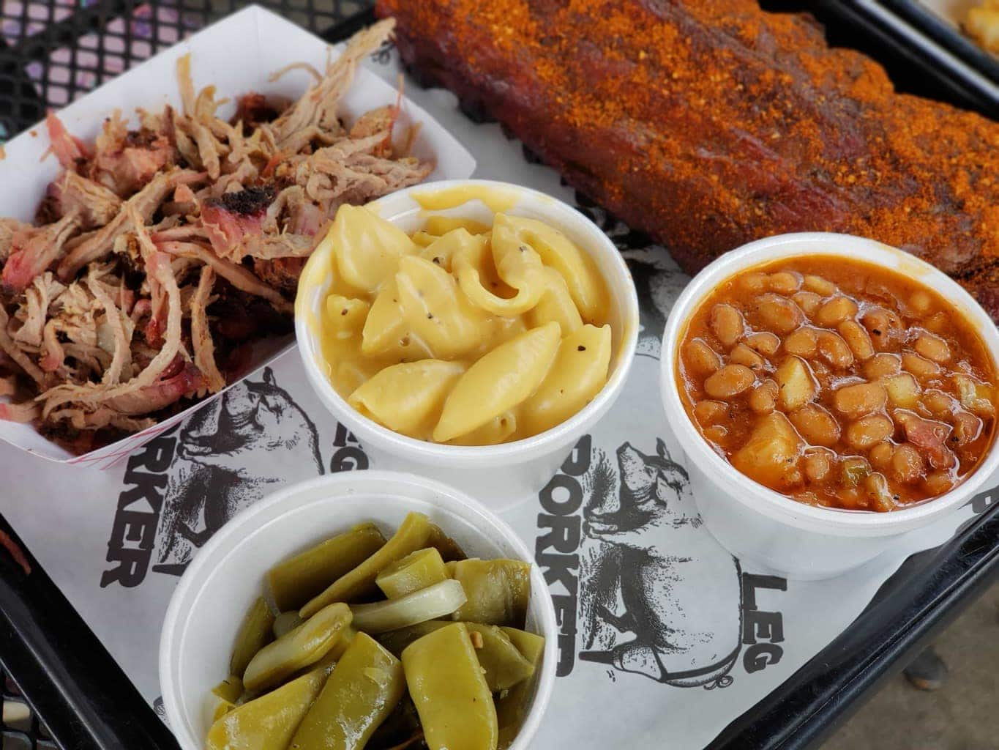

# Peg Leg Porker

**Neighborhood:** Pie Town
**Price:** $
**Vibe tags:** food, Pie Town

## Why it's worth it
Just excellent pulled pork BBQ

## Top picks
- pasta
- negroni

## Good for
lunch, dinner

## Quick details
- Address: 903 Gleaves St, Nashville, TN 37203
- Map: https://maps.app.goo.gl/AxU7WL9gDkraP9Cs6
- Website: http://www.peglegporker.com/
